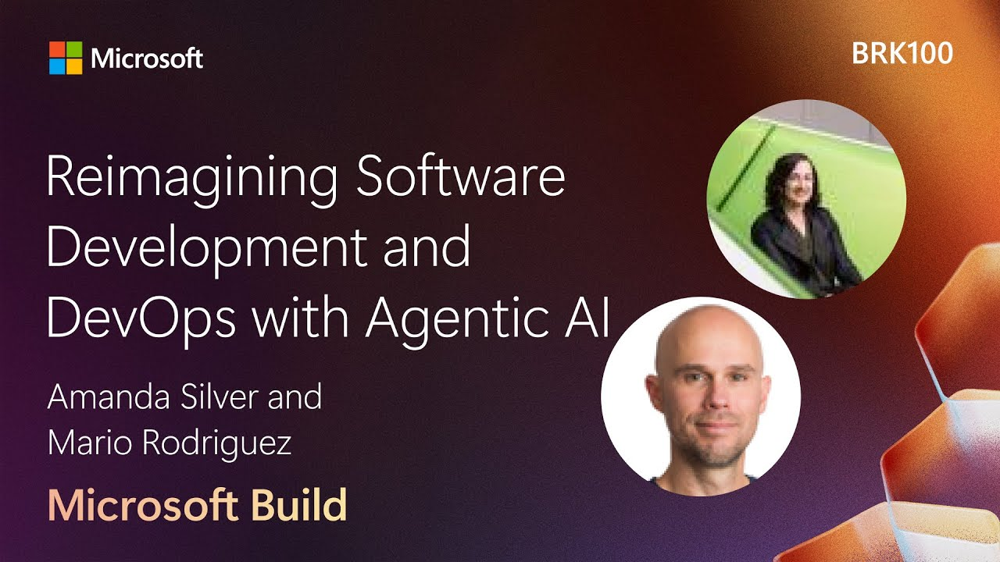

# 🐕 Octopets

A simple web app for discovering and sharing pet-friendly homes, parks, cafés, and custom venues for your fur babies.


## 📽️ See it in action

The project was presented at Microsoft Build 2025 during the [Reimagining Software Development and DevOps with Agentic AI](https://build.microsoft.com/en-US/sessions/BRK100?source=sessions) session. You can also catch up with the video, where you can see Octopets in action:

[](https://www.youtube.com/watch?v=eVPHMMrORbA)

## 🙋‍♂️ About the project

Octopets is a platform designed to help pet owners find and share pet-friendly venues. The application allows users to:

- Browse and search for pet-friendly venues by pet type and venue type
- View details about each venue, including allowed pet types, amenities, and photos
- Navigate between main pages: Home, Listings, Add Listing, Listing Details, and Reviews

## 🏗️ Tech stack

| Category | Technology |
| --- | --- |
| Frontend | React with TypeScript (functional components and hooks, 2025 latest) |
| Routing | React Router v7 |
| Backend | ASP.NET Core 9.0 with Minimal APIs |
| Database | PostgreSQL 15 Flexible Server with Entity Framework Core 9.0 |
| Application Hosting | Azure Container Apps |
| Styling | Custom CSS with responsive design |
| Containerization | Docker for both frontend and backend deployment |
| Infrastructure | Azure Bicep templates |
| Monitoring | Azure Application Insights |

## 🚀 Getting started

### 💻 Prerequisites

| Requirement | Version | Download Link |
| --- | --- | --- |
| .NET SDK | 9.0 or later | [Download .NET](https://dotnet.microsoft.com/download/dotnet/9.0) |
| Node.js | v18.0.0 or later | [Download Node.js](https://nodejs.org/) |
| npm | v10.0.0 or later | [npm Docs](https://docs.npmjs.com/downloading-and-installing-node-js-and-npm) (included with Node.js) |
| Docker | Latest | [Download Docker](https://www.docker.com/products/docker-desktop/) |
| Visual Studio | Latest | [Download Visual Studio](https://visualstudio.microsoft.com/downloads/) |
| Visual Studio Code | Latest | [Download VS Code](https://code.visualstudio.com/) |
| C# Dev Kit | Latest | [C# Dev Kit Extension](https://marketplace.visualstudio.com/items?itemName=ms-dotnettools.csdevkit) |

### 💬 Prompts

You can find prompts that can be used to generate the project as well as automatically identity and run tests on it in the [`.github/prompts`](/.github/prompts/) folder.

### 📦 Installation

1. Clone the repository
   ```
   git clone https://github.com/Azure-Samples/octopets.git
   cd octopets
   ```

2. Install the frontend dependencies
   ```
   cd frontend
   npm install
   cd ..
   ```

3. Start the application using Aspire AppHost
   ```
   dotnet run --project apphost
   ```
   
   Alternatively, open the `Octopets.sln` solution in Visual Studio and run the AppHost project.

4. The Aspire dashboard will open in your browser, providing access to:
   - Frontend application (React)
   - Backend API endpoints with Scalar UI
   - Distributed application monitoring
   - Health check statuses
   - Logs and telemetry

## 🏛️ Architecture

The application uses a modern distributed architecture powered by .NET Aspire:

- **.NET Aspire AppHost**: Orchestrates all application components and provides:
  - Service discovery and communication
  - Resource management
  - Environment configuration
  - Health checks and monitoring
  - Standardized logging
  
- **ASP.NET Core Backend**: 
  - Implements the API with Minimal APIs approach
  - Uses repository pattern for data access
  - In development: uses Entity Framework Core with in-memory database
  - In production: configurable for SQL Server, PostgreSQL, or Azure SQL
  
- **React Frontend**: 
  - Containerized with Docker
  - Single-page application using React Router
  - Fully responsive design with custom styling
  - TypeScript for type safety
  
- **Mock Data System**: 
  - Configurable via environment variables in Aspire AppHost
  - Automatically disabled in production mode
  - See "Mock Data System" section below for details

## 📊 Mock data

Octopets uses a mock data system for both the frontend and backend to simplify local development and testing. This allows you to run the app without a persistent database or live API, and ensures the frontend and backend use consistent data models and sample content.

### 🙋‍♀️ How mock data works

- **Frontend**: Uses TypeScript mock data files in `frontend/src/data/` (notably `listingsData.ts`) and a configuration flag to determine whether to use mock data or fetch from the backend API.
- **Backend**: Uses Entity Framework Core's in-memory database and seeds mock data in `backend/Data/AppDbContext.cs`.
- The mock data for listings, reviews, ratings, and photos is kept consistent between frontend and backend for a seamless development experience.

### 📝 Aspire AppHost configuration for mock data

The AppHost project (`apphost/Program.cs`) automatically configures both the frontend and backend services to use mock data in development mode:

```csharp
// Mock data is enabled in development mode, disabled in publish/production mode
var useMockData = builder.ExecutionContext.IsPublishMode ? "false" : "true";

// Configure backend
var api = builder.AddProject<Projects.Octopets_Backend>("octopets-backend")
    // Other configuration...
    .WithEnvironment("ENABLE_CRUD", builder.ExecutionContext.IsPublishMode ? "false" : "true");

// Configure frontend
var frontend = builder.AddDockerfile("octopets-frontend", "../frontend", "Dockerfile")
    // Other configuration...
    .WithEnvironment("REACT_APP_USE_MOCK_DATA", useMockData);
```

This ensures that both the frontend and backend are synchronized in their use of mock data:
- In development: Both use mock data
- In production: Both use real data services

### 🎚️ Enabling/disabling mock data

- **Frontend**: Controlled by the environment variable `REACT_APP_USE_MOCK_DATA`.
  - To enable mock data, set `REACT_APP_USE_MOCK_DATA=true` before starting the frontend dev server.
  - To disable and use the real backend API, set `REACT_APP_USE_MOCK_DATA=false` (default is false if not set).
  - The logic is implemented in `frontend/src/config/appConfig.ts` and used in `frontend/src/data/dataService.ts`.

- **Backend**: Always uses in-memory mock data in development (see `backend/Program.cs` and `backend/Data/AppDbContext.cs`).
  - No persistent database is required for local development.
  - The mock data is seeded on startup and matches the frontend mock data structure.

### 🗃️ Required files

- **Frontend**:
  - `frontend/src/data/listingsData.ts`: Main mock listings data.
  - `frontend/src/data/dataService.ts`: Data service that switches between mock and API.
  - `frontend/src/config/appConfig.ts`: Reads environment variable for mock data toggle.
- **Backend**:
  - `backend/Data/AppDbContext.cs`: Seeds mock listings and reviews into the in-memory database.
  - `backend/Models/Listing.cs`: Data model for listings (includes `Rating`, `Photos`, etc.).

### 🌱 Data model consistency

- The mock data for listings includes fields like `rating`/`Rating` and `photos`/`Photos` on both frontend and backend.
- When updating the data model, ensure changes are reflected in both the frontend mock data and backend seed data for consistency.

### 🎨 Customizing mock data

- You can edit the mock data directly in the files listed above to add, remove, or modify sample venues, reviews, ratings, and photos.
- For more listings, simply add new objects to the arrays in `listingsData.ts` (frontend) and the `SeedData` method in `AppDbContext.cs` (backend).

### 🧑‍🚀 Production/deployment

When deploying to production:

1. **Build and Publish**:
   ```
   dotnet publish -c Release
   ```

2. **Azure Deployment** (using .NET Aspire integration):
   - The AppHost project includes Azure support in the `azure.yaml` file
   - Configure Azure Application Insights for monitoring (automatically added by AppHost)
   - Set `REACT_APP_USE_MOCK_DATA=false` for the frontend service
   - Configure a real database connection for the backend service

3. **Configuration Management**:
   - Sensitive configuration can be stored in Azure App Configuration or Key Vault
   - The AppHost project supports reading configuration from Azure services

4. **Monitoring**:
   - Application Insights is automatically configured in production mode
   - Dashboard access is available through the Azure portal

## 🚀 Deployment to Azure

This repository provides comprehensive guides for deploying Octopets to Azure Container Apps with PostgreSQL:

### 📖 **Available Guides**

| Guide | Description | Use Case |
|-------|-------------|----------|
| **[DEPLOYMENT_INSTRUCTIONS.md](./DEPLOYMENT_INSTRUCTIONS.md)** | Complete step-by-step deployment guide | New Azure deployments |
| **[BREAKING_SCENARIOS_GUIDE.md](./BREAKING_SCENARIOS_GUIDE.md)** | PostgreSQL connectivity failure scenarios | SRE testing and training |
| **[DEPLOYMENT_GUIDE.md](./DEPLOYMENT_GUIDE.md)** | Alternative deployment methods | Advanced configurations |

### 🎯 **Quick Start**
```bash
# 1. Clone and setup
git clone https://github.com/surivineela/octopets_postgresql.git
cd octopets_postgresql

# 2. Deploy infrastructure 
az group create --name "octopets-prod-rg" --location "eastus"
az deployment group create --resource-group "octopets-prod-rg" \
  --template-file infrastructure/main.bicep \
  --parameters location="eastus" environment="prod" appName="octopets" \
    dbAdminLogin="octopetsadmin" dbAdminPassword="YourSecurePassword123!"

# 3. Build and deploy container apps (see full guide for details)
```

### 🛠️ **What You Get**
- ✅ **Production-ready** Azure Container Apps deployment
- ✅ **PostgreSQL Flexible Server** with proper security
- ✅ **Docker containerization** for both frontend and backend
- ✅ **Infrastructure as Code** using Azure Bicep
- ✅ **Breaking scenarios** for SRE testing and incident response training

## 💼 License

This project is licensed under the MIT License - see the LICENSE file for details.
